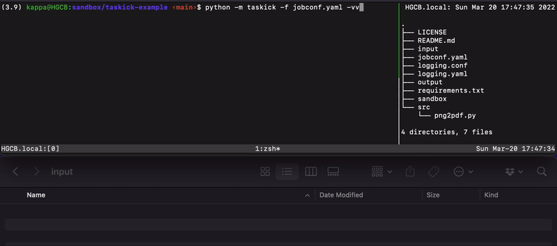

# Taskick

Taskick is an event-driven library implemented in Python that automatically executes scripts.
You can automate tedious routine tasks and operations.

Users can concentrate on developing scripts to run, and simply create a configuration file (YAML) to automatically execute scripts triggered by any date, time, or event.

The main features of Taskick are as follows

- Script execution timing can be managed in a configuration file (YAML).
- Can specify datetime and directory/file operations as task triggers.
- Execution schedules can be specified in Crontab format.
- [Watchdog](https://github.com/gorakhargosh/watchdog) is used to detect directory and file operations, and any [events API](https://python-watchdog.readthedocs.io/en/stable/api.html#module-watchdog.events) can be specified in the configuration file.

## Installation

```shell
pip install taskick
```

## Toy Example

Here is a toy-eample that converts a PNG image to PDF.
In this sample, Taskick starts a script when it detects that a PNG image has been saved to a specific folder.
The script converts the PNG to PDF and saves it in another folder.
For more information, please see the [project page](https://github.com/atsuyaide/taskick-example).

First, clone [taskick-example](https://github.com/atsuyaide/taskick-example).

```shell
git clone https://github.com/atsuyaide/taskick-example.git
```

Go to the cloned directory and start Taskick.

```shell
$ cd taskick-example
$ pip install -r requirements.txt
$ python -m taskick -f jobconf.yaml -v info
INFO:taskick:Loading tasks...
INFO:taskick:Processing: example_task_1
INFO:taskick:Immediate execution option is selected.
INFO:taskick:Processing: auto_remove_input_folder
INFO:taskick:Immediate execution option is selected.
INFO:taskick:Processing: png2pdf
INFO:taskick:Done.
INFO:taskick:Executing: example_task_1
INFO:taskick:Executing: auto_remove_input_folder
Sat Mar 19 23:51:47 JST 2022 Welcome to Taskick!
```

When a PNG image is saved in the input folder, a converted PDF file is output in the output folder.
Files in the input folder are automatically deleted at startup or every minute.




These tasks are controlled by `jobconf.yaml` and managed by Taskick.
